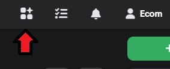
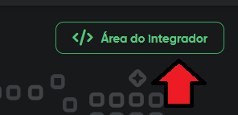
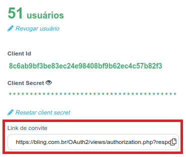

# Bling ERP V2 - BETA

Aplicativo ainda em versão Beta

## 1) Criar aplicativo no dashbord do Bling
Na versão Beta será necessário seguir alguns procedimentos no painel do Bling

### Acesse a área de Apps no Bling

 

### Em seguida a Área do Integrador 
 

### Clique em Criar Aplicativo

**ATENÇÃO**:  Antes de acionar o link do convite do aplicativo criado no Bling é necessário adicionar  e salvar os `client_id` e `client_secret` aqui nas configurações desse aplicativo.

* **Lista de escopos**

Lista de escopos necessários a ser habilitados no painel do Bling

1) **Campos Customizados**
1) **Campos Customizados**: Clientes e Fornecedores
1) **Campos Customizados**: Produtos
1) **Categoria de Produtos**
1) **Categoria de Produtos**: Gerenciar Categorias de Produtos
1) **Clientes e Fornecedores**: Gerenciar Contatos
1) **Controle de Estoque**
1) **Controle de Estoque**: Controle avançado de estoque: Edição e exclusão de Estoque
1) **Controle de Estoque**: Controle avançado de estoque: Inserção de Estoque
1) **Gerenciador de transições**
1) **Integrações Logísticas**
1) **Integrações e Lojas Virtuais**
1) **Notas Fiscais**
1) **Pedidos de Venda**
1) **Pedidos de Venda**: Gerenciar Pedidos de Venda
1) **Pedidos de Venda**: Gerenciar situações dos Pedidos de Venda
1) **Produtos**
1) **Produtos**: Gerenciar Produtos
1) **Produtos**: Salvar imagens dos Produtos
1) **Produtos**: Salvar variações de Produtos


* **Link de redirecionamento**

```https://us-central1-ecom-bling-v2.cloudfunctions.net/app/bling/authentication?store_id=SEU_STORE_ID_AQUI```


###  Siga a referência para concluir a criação do Aplicativo no Bling
<a href="https://developer.bling.com.br/aplicativos#introdu%C3%A7%C3%A3o" target="_blank">Referência do Bling</a>

Siga a referência  até confirmação de salvamento

### Ao finalizar:

Você terá a seguinte tela: 
 

* Copie o ***Client Id*** e aqui nas configurações do app
* Abra o ***Client Secret*** copie e aqui nas configurações do app

* Copie o ***Link de convite*** e cole em outra Aba de seu navegador (Browser) e autorize o aplicativo


## 2) Habilitar Callback (webhook) do Bling

Para habilitar os callbacks do bling é necessário adicionar um aplicativo no painel do Bling através do seu Marketplace de aplicativos,
<a href="https://ajuda.bling.com.br/hc/pt-br/articles/360047064713-Callback-de-altera%C3%A7%C3%A3o-de-situa%C3%A7%C3%A3o" target="_blank">veja aqui como adicionar</a>.


* **Tipo de retorno no callback** : _JSON (urlencoded)_

* **URL para os callbacks:** ```https://us-central1-ecom-bling-v2.cloudfunctions.net/app/bling/callback?store_id=SEU_STORE_ID_AQUI```
